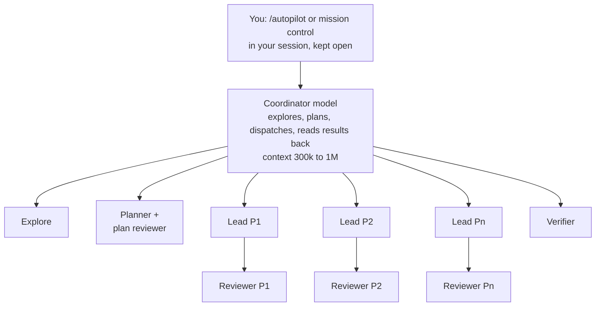
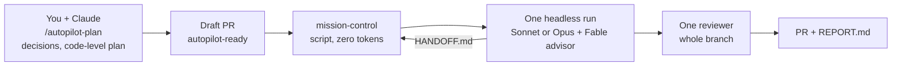

# Autopilot 3.x compared with 1.x - 2026-09-26

Moved out of `docs/autopilot-developer-guide.md`, which describes only the current state.

Plugin 1.x put a **model in charge**: in a session, a coordinating model ("mission control" at
the time) explored, planned, dispatched one lead agent per package, a reviewer per package, a
verifier, and read their results back. That looked like a team, and it behaved like one that
spends most of its day in meetings. We measured it on real sessions
(`docs/2026-09-19-token-efficiency-review.md`) and rebuilt it in two steps: 2.0 removed the
coordinator, 3.0 made every run headless and moved the design work into the plan
(`docs/2026-09-20-autopilot-v2.md`, `docs/2026-09-21-autopilot-v3.md`).

**1.x: a model coordinates models**

**3.x: you plan, a script runs, one context works**

| | 1.x | 3.x (now) |
| --- | --- | --- |
| Who coordinates | a model; 28% of the session cost on its own, context grew to 1.06M and was re-written after idle gaps | a shell script (`mission-control`); costs no tokens |
| Agents per ticket | 33 agents, 1,795 requests for one ticket (WEB-1095) | one run context, one reviewer, plus hand-off sessions when the context fills up |
| Cost per ticket (list price) | about $220 for WEB-1095; up to $100+ even for a standalone run | PAUL-2649, three packages: $9.99 + $6.00 across two runs, PR with green CI |
| Cache reads per package | ~45M with lead agents | ~9M in 2.x; 3.x lower by design, measured per run with `autopilot-usage` |
| Who designs the code | the run, while running: plans listed files, not insertion points, so the implementer invented signatures and flows | you and the planner, before the run: `path:line` anchors, signatures, pseudo-code, test cases; the run executes |
| Decisions | made by the coordinator, mid-run, invisible until the end | asked once while planning, written into `PLAN.md`; the rest in `DECISIONS.md` |
| Reviews | one per package (15 for WEB-1095) | one adversarial review on the whole branch, Codex, then the Claude review bot with every comment answered |
| Running out of context | auto-compaction (drops history and skill bodies), later a budget hook that measured the wrong transcript | deterministic hand-off at 500k tokens, the runner restarts a fresh session up to 5 times |
| Stranded work | a standalone run that handed off waited for someone to restart it (still so in 2.x) | every run is started and chained by the runner; nothing waits for a person |
| Browser check | desktop-app browser tools only, so no UI check without an open desktop session (UI tickets ended blocked in the first headless runs) | `agent-browser` headless, with a saved login where needed |
| Jira | desktop-app connectors, used by the model when it remembered to | the runner sets In Progress and comments the result, every time |
| Your time | start a session and keep it running, often for hours, in one case five days | three short moments of questions while planning, then review the PR |
| Who can use it | whoever runs the session on their own machine | every developer: plan, label the draft PR, results arrive on the PR and in Slack |

Why it adds up:

1. **Cost is context size times number of requests.** A coordinator carries everything it has
   seen into every request. A script has no context at all, and one run with a bounded
   context and a hand-off makes far fewer, smaller requests.
2. **Multi-agent pays off for parallel research, not for coding.** Anthropic's own write-up
   says so, and the 1.x numbers agree: most coding work is sequential, so extra agents mostly
   add base loads and hand-over reading.
3. **Deciding is expensive, executing is cheap.** Design questions now happen once, with you,
   on a strong model; the run follows steps instead of inventing them. That is
   also why the result matches what you asked for more often: the decisions are yours and
   written down, not guessed at 3 a.m.
4. **Nothing depends on a session staying open.** The queue, the restarts, the ticket
   updates and the notifications are code, not a model's good intentions.

Honest caveats: the $220 and $16 figures come from different tickets, so they show the order
of magnitude, not an exact ratio. Each run prints its own `autopilot-usage` table, so every
ticket adds a real data point.
