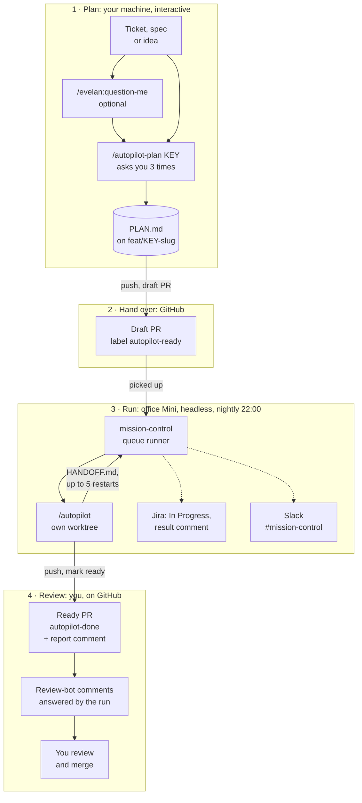
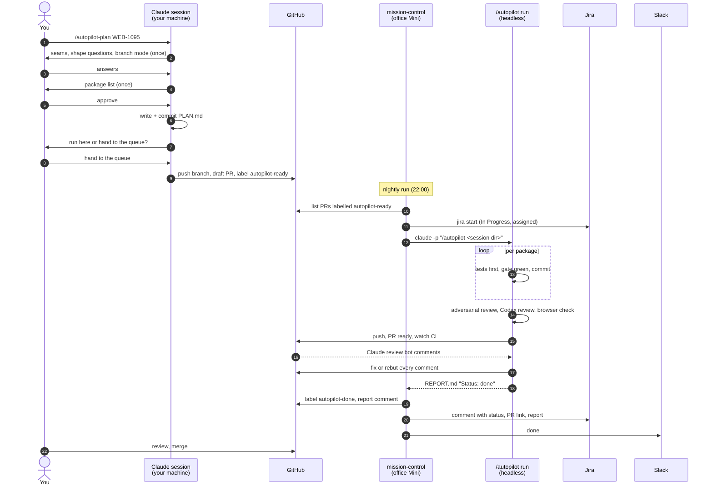
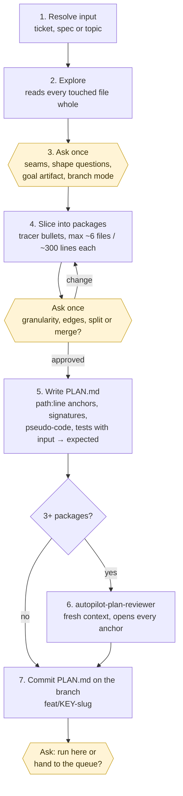
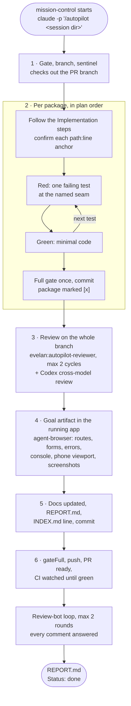
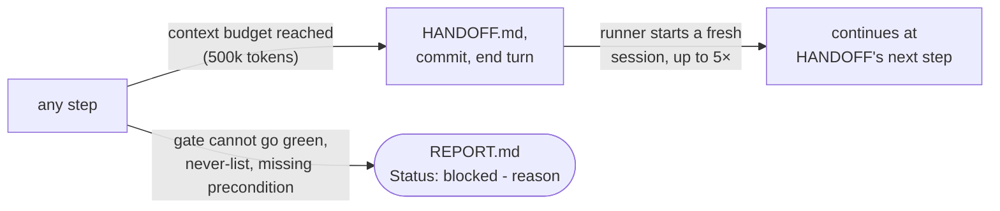
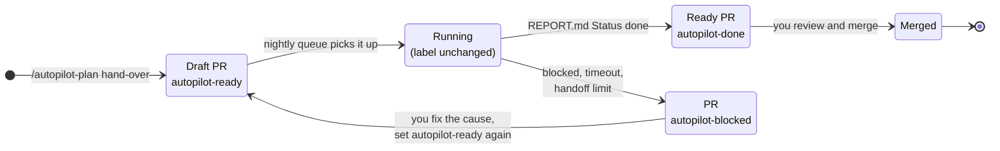
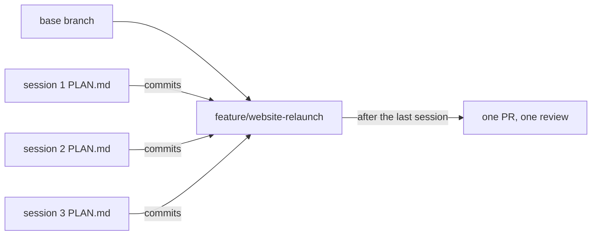

# Autopilot for developers

How a developer at Evelan hands a ticket to the autopilot and gets a reviewed PR back.
This guide covers your side of the workflow. The skill details are in
`skills/autopilot-plan/SKILL.md`, `skills/autopilot/SKILL.md` and
`skills/autopilot/references/mission-control.md`.

**In one sentence:** you write the plan together with Claude in your own session, open a
draft PR with the label `autopilot-ready`, and the queue on the office Mini implements it
overnight and returns a ready PR with a report, which you review and merge.

## Contents

1. [The big picture](#1-the-big-picture)
2. [Who does what](#2-who-does-what)
3. [Before your first run](#3-before-your-first-run)
4. [Step by step](#4-step-by-step)
5. [What happens inside a run](#5-what-happens-inside-a-run)
6. [PR labels and their meaning](#6-pr-labels-and-their-meaning)
7. [Reviewing the result](#7-reviewing-the-result)
8. [When a run is blocked](#8-when-a-run-is-blocked)
9. [Feature branches: several sessions, one PR](#9-feature-branches-several-sessions-one-pr)
10. [Rules and limits](#10-rules-and-limits)
11. [Cheat sheet](#11-cheat-sheet)

## 1. The big picture

The work is split in two: the **plan** is written interactively, with you in the loop,
because that is where the decisions are. The **run** is headless and asks nothing, because
every decision is already in the plan.



## 2. Who does what

| Step | Who | Where | Output |
| --- | --- | --- | --- |
| Set up the project once | you or Andreas | your session, `/autopilot init` | gate, hooks, labels in the repo |
| Add the repo to the queue once | Andreas | office Mini, `repos.txt` | the queue sees the repo's labelled PRs |
| Sharpen the idea (optional) | you + Claude | your session, `/evelan:question-me`, `/evelan:to-spec` | spec, ADRs, `CONTEXT.md` |
| Write the plan | you + Claude | your session, `/autopilot-plan` | `PLAN.md` on the branch |
| Hand it over | Claude, on your go | your session, step 7 of the plan skill | draft PR labelled `autopilot-ready` |
| Implement, test, review, verify | the run | office Mini, headless | commits, `REPORT.md`, ready PR |
| Ticket and notifications | `mission-control` | office Mini | Jira In Progress + comment, Slack, PR label |
| Review and merge | you | GitHub | merged PR |

The run **never merges** and never sets a ticket to Done. Merging stays with you.



## 3. Before your first run

Once per **project** (skip what is already there; `.claude/autopilot.json` in the repo means
it was done):

```
claude
> /autopilot init
```

It detects the package manager, writes the gate (typecheck, lint, test) into
`.claude/autopilot.json`, installs four hooks into `.claude/hooks/` and
`.claude/settings.json`, adds runtime files to `.gitignore`, and creates the labels
`autopilot-ready`, `autopilot-done` and `autopilot-blocked` (plus `claude-re-review` when
the project has the Claude review workflow). Commit and
merge that setup like any other change.

Two things need Andreas:

- **The repo in the queue.** The office Mini only looks at repos listed in its `repos.txt`.
  A repo that is not on it yet: send Andreas the PR link after your first hand-over.
- **A browser login for the run**, if the goal artifact sits behind a login (dashboard,
  admin area). The state file is saved once by hand on the Mini
  (`/autopilot init` prints the recipe). Without it, logged-in checks land in
  `MANUAL_TESTING.md` for you to do.

On **your machine** you need only the plugin (`/plugin install evelan@evelan-plugins`) and
`gh` logged in. No queue, no Jira token, no `agent-browser`. `/mission-control` and
`mission-control` refuse on a machine without a queue and point you back here; that is
expected.

## 4. Step by step

### 4.1 Start from a ticket (or create one)

`/autopilot-plan` accepts a ticket key (`WEB-1095`, `#42`), a spec file, or a plain topic.
A topic without a ticket gets its ticket created through the project's tracker once the
shape is settled. If the topic still has open decisions ("should we even do X?"), settle
them first with `/evelan:question-me`; the plan skill stops on open decision tickets.

### 4.2 Write the plan

```
claude            # Fable is the intended planner, Opus is fine
> /autopilot-plan WEB-1095
```

What the skill does, and where it needs you:



The yellow boxes are the three moments you are asked. Answer them carefully: every point you
leave open is later decided conservatively by the run and written into `DECISIONS.md`.

Good answers to the shape questions name:

- **the goal artifact**: what you will look at to accept the work ("the export button works
  at `/reports` in the local app", "report at `docs/x.md`"). The run verifies exactly this
  in a real browser. "Gate green" is not a goal artifact.
- **what is out of scope**, so the run does not build it.
- **the branch mode**: one branch and PR per session (default) or a shared feature branch
  (section 9).

The plan lands in `docs/autopilot/sessions/<date>-<KEY>-<slug>/PLAN.md`. Read it before you
hand it over. Worth a glance: `Effort:` (runner effort, `medium` by default), `Options:`
(`defer PR`, `no Codex`), the Goal artifact, the Decisions, and whether the package list
matches what you had in mind.

### 4.3 Hand it to the queue

At the end of `/autopilot-plan` answer **"hand to the queue"**. The skill pushes the branch
and opens a draft PR against the base:

- title `<KEY>: <destination in a few words>`
- body: destination, goal artifact, path of `PLAN.md`
- label `autopilot-ready`

The draft status matters: the Claude review bot skips drafts, so it reviews only once the
run marks the PR ready.

To hand over an existing plan by hand: push the branch, open a draft PR and add the label
`autopilot-ready`. That is all the queue looks for.

### 4.4 Wait for the result

The queue on the office Mini runs **nightly at 22:00**, one item at a time. Andreas can also
start it on demand. You do not need to keep your machine or session open.

While the item runs:

- the Jira ticket moves to **In Progress** and is assigned to the token owner;
- the run works in its own worktree on the Mini on **your PR branch**. Do not push to that
  branch while it runs. A fix you push before the next attempt is picked up (the worktree
  fast-forwards before every start and restart), but concurrent pushes can conflict.

When it ends you get:

- a Slack message in `#mission-control` (done or blocked, with the reason);
- the PR label `autopilot-done` or `autopilot-blocked`, and a comment "Autopilot report"
  with the head of `REPORT.md`;
- a comment on the Jira ticket with status, PR link and report summary.

## 5. What happens inside a run

You do not steer the run, but knowing its steps tells you what the report means and where
to look when something is off.



Two exits can happen at any step:



Details that matter for you as a reviewer:

- **Tests first, at the seams from the plan.** A test is written, seen failing, then made
  green. The run never weakens an assertion to get green.
- **One evidence line per gate run** in `.claude/autopilot-gate.log` (machine-local); each
  package commit has a gate result behind it.
- **Adversarial review.** A separate reviewer in a fresh context checks the branch against
  `PLAN.md`: completeness, correctness, safety, stale docs. Real gaps are fixed test-first;
  what remains goes to the top of `REPORT.md` and into the PR description.
- **Codex review** runs by default when the Codex CLI is on the Mini. Its findings are fixed
  or rebutted with evidence in `REPORT.md`. Turn it off with `Options: no Codex`.
- **The goal artifact is exercised in the running app**, headless through `agent-browser`,
  with screenshots in the session folder. Checks the run cannot perform (a login without a
  state file, a device, a payment) go to `MANUAL_TESTING.md`.
- **Hand-offs are normal.** A large plan outgrows one context. The run writes `HANDOFF.md`,
  and the runner starts a fresh session that continues at the next step. You see
  `restarts=N` in the queue log; the result is still one branch.

## 6. PR labels and their meaning



| Label | Meaning | Your move |
| --- | --- | --- |
| `autopilot-ready` | waiting for the queue (or running) | nothing; do not push to the branch |
| `autopilot-done` | run finished, PR is ready, report posted | review (section 7) |
| `autopilot-blocked` | run stopped, reason in the PR comment and in Slack | fix the cause, relabel (section 8) |
| `claude-re-review` | asks the Claude review bot for one more full review | add after your own changes if you want a second bot pass; the workflow removes it |

## 7. Reviewing the result

Treat the PR like a colleague's PR, with better paperwork. Everything the run did is in the
session folder on the branch, `docs/autopilot/sessions/<date>-<KEY>-<slug>/`:

| File | Read it for |
| --- | --- |
| `REPORT.md` | first line `Status: done`; What shipped, Verification (commands and results, browser checks), Review (reviewer and Codex findings and what happened to them), Open items, Review bot |
| `DECISIONS.md` | every assumption the run made on its own; the place to disagree |
| `MANUAL_TESTING.md` | the steps only a human can do; do them before merging |
| `PLAN.md` | packages marked `[x]` with a one-line result each, or `[!]` with the gap named |
| `*.png` | one screenshot per screen from the browser check |

A reasonable order: `REPORT.md` top (unresolved gaps come first), `DECISIONS.md`, then the
diff, then `MANUAL_TESTING.md`. On the PR itself every review-bot comment has a reply from
the run: `Fixed in <sha>` or `Not changed: <reason>`.

Found something? Two options:

- **small**: fix it yourself on the branch and push, like on any PR;
- **new review-bot findings** (after a `claude-re-review`): relabel `autopilot-ready`. A run
  on a branch with a `Status: done` report and an open PR resumes in its review phase: it
  verifies the new findings, fixes or rebuts them, and updates the report;
- **larger, or the plan was wrong**: comment what is missing, then write a follow-up plan
  with `/autopilot-plan` (a new ticket, its own branch and PR). The done branch is not
  re-planned in place.

## 8. When a run is blocked

The PR comment and the Slack message carry the reason; `REPORT.md` (if written) starts with
`Status: blocked - <reason>`.

| Reason (roughly) | Typical cause | Fix |
| --- | --- | --- |
| gate cannot go green | failing tests on the base, flaky setup, missing env for tests | fix the base or the test setup, push |
| missing precondition | database, seeded user, service not available on the Mini | ask Andreas, or put the setup into the project's scripts |
| needs a browser login | goal artifact behind a login, no `browserState` for the project | Andreas saves the state file on the Mini |
| never-list | the task needs migrations, secrets, env files, production config, force-push | do that part yourself, then relabel |
| `handoff-limit` | plan too large for five sessions | split the plan into smaller packages or two plans |
| `timeout` / stalled | a hanging process (dev server, watch mode), 240 min per attempt | check the log line in the PR comment, fix the script |
| no session directory | no `PLAN.md` on the PR branch, and the run wrote none | commit the plan on the PR branch (without one the run writes its own, marked `no-plan`) |

After the fix: push to the branch, then swap `autopilot-blocked` back to `autopilot-ready`.
The next queue run continues from the kept worktree, not from scratch.

## 9. Feature branches: several sessions, one PR

For a feature too large for one plan, choose **feature branch** as branch mode in
`/autopilot-plan`. Each session commits straight onto the shared feature branch, no PR per
session; the feature branch gets one PR and one review when the last session is done.



There is no PR label to hand over a feature-branch session. The hand-over is pushing the
feature branch and adding the item to the queue with `mission-control add <repo> <session
dir>` on the Mini; ask Andreas (or anyone with SSH access through `/mission-control`).

## 10. Rules and limits

- **The plan is the whole spec.** The run sees `PLAN.md`, not the ticket history or your
  Slack thread. Put everything that matters into the plan.
- **No questions during the run.** Open points are decided conservatively and logged in
  `DECISIONS.md`.
- **Done means the goal artifact works**, verified in the running app. "Wired but off by
  default" is not done.
- **Never-list**: no force-push, no `migrations/`, no secrets or env files, no production
  config, no CI credentials, no other people's branches. A task that needs one of these
  ends blocked.
- **Docs are part of done.** The run updates README, `docs/`, `CLAUDE.md` and doc comments
  its change made stale.
- **Limits per item:** $60 budget per run, 240 minutes per attempt, five restarts after a
  hand-off, stall kill after 80 minutes without a tool call or commit.
- **Model setup:** planning on Fable (Opus is fine) in your session; the run on Sonnet with
  Fable as advisor and Opus as fallback; the final reviewer on Opus.

## 11. Cheat sheet

```
# once per project
/autopilot init                        # gate, hooks, labels; commit the result

# per ticket
/evelan:question-me                    # optional: when the shape is still open
/autopilot-plan WEB-1095               # plan with you in the loop
  → answer "hand to the queue"         # draft PR, label autopilot-ready

# afterwards, on GitHub
autopilot-done     → review REPORT.md, DECISIONS.md, MANUAL_TESTING.md, diff; merge
autopilot-blocked  → fix the cause, push, relabel autopilot-ready
claude-re-review   → one more Claude bot review after your own changes
```

Questions about the queue, a repo that is not picked up, or a login state file: Andreas.
