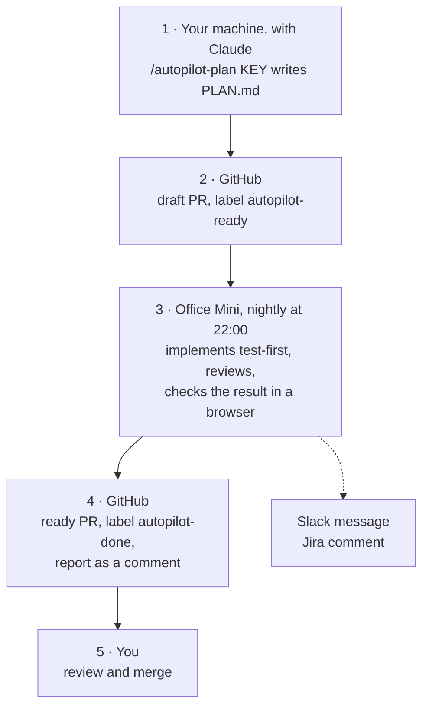
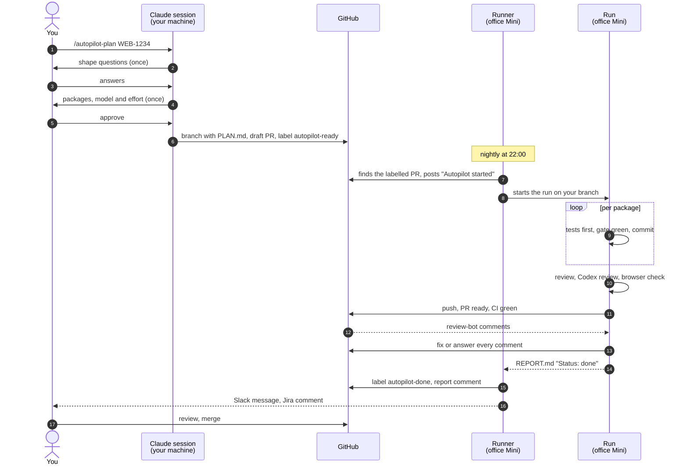
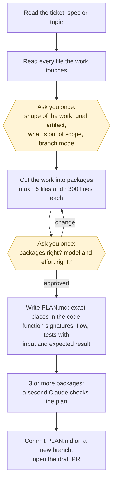
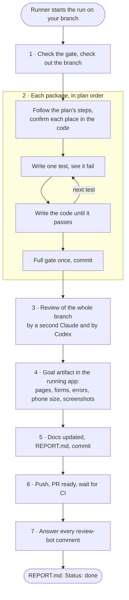
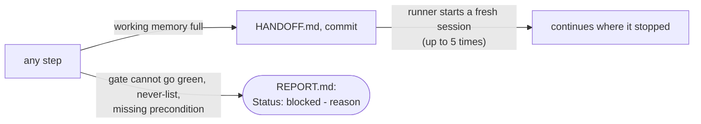
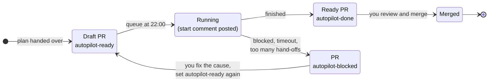
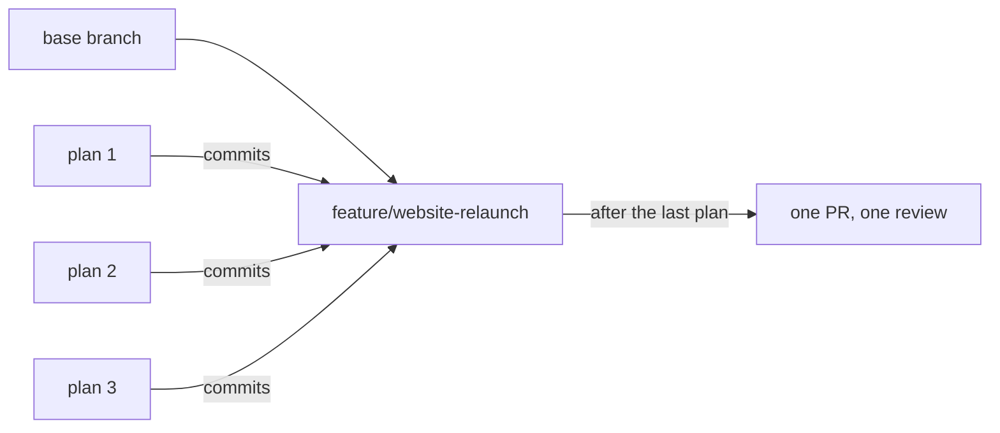

# Autopilot for developers

How you hand a ticket to the autopilot and get a reviewed pull request back.

**In one sentence:** you write the plan together with Claude in your own session, Claude
opens a draft PR with the label `autopilot-ready`, and the queue on the office Mini
implements it overnight and returns a ready PR with a report, which you review and merge.

The full instructions behind this guide:
[plan skill](../skills/autopilot-plan/SKILL.md) ·
[run skill](../skills/autopilot/SKILL.md) ·
[queue (mission control)](../skills/autopilot/references/mission-control.md) ·
[plan template](../skills/autopilot-plan/references/plan-template.md)

## Contents

1. [How it works](#1-how-it-works)
2. [Terms](#2-terms)
3. [Who does what](#3-who-does-what)
4. [Before your first ticket](#4-before-your-first-ticket)
5. [Step by step](#5-step-by-step)
6. [What happens inside a run](#6-what-happens-inside-a-run)
7. [PR labels and their meaning](#7-pr-labels-and-their-meaning)
8. [Reviewing the result](#8-reviewing-the-result)
9. [When a run is blocked](#9-when-a-run-is-blocked)
10. [Feature branches: several plans, one PR](#10-feature-branches-several-plans-one-pr)
11. [Rules and limits](#11-rules-and-limits)
12. [Cheat sheet](#12-cheat-sheet)

## 1. How it works

The work is split in two. The **plan** is written with you, because that is where the
decisions are. The **run** asks nothing, because every decision is already in the plan.



## 2. Terms

| Term | Meaning |
| --- | --- |
| Plan (`PLAN.md`) | The complete work order. The run reads nothing else: not the ticket, not Slack. |
| Package | One slice of the plan that works end to end on its own and ends with one commit. |
| Gate | The project's check command (typecheck, lint, tests), stored in `.claude/autopilot.json`. It must be green before every commit. |
| Goal artifact | What you will look at to accept the work, for example "the export button works at `/reports`". The run checks exactly this. |
| Seam | The place where the tests hook into the code: a public function, an API route, a page. |
| Queue, runner | `mission-control`, a script on the office Mini that starts the runs one after another. |
| Hand-off | When a run's working memory is full it writes `HANDOFF.md`, and the runner starts a fresh session that continues from there. |
| Never-list | What a run never does: force-push, database migrations, secrets or env files, production config, CI credentials, other people's branches. |
| Worktree | A separate copy of the repo on the Mini in which one run works. |

## 3. Who does what

| Step | Who | Where | Result |
| --- | --- | --- | --- |
| Set up the project once | you or Andreas | your session, `/autopilot init` | gate, hooks, labels in the repo |
| Add the repo to the queue once | Andreas | office Mini | the queue sees the repo's labelled PRs |
| Sharpen the idea (optional) | you + Claude | your session, `/evelan:question-me`, `/evelan:to-spec` | spec, decisions, terms |
| Write the plan | you + Claude | your session, `/autopilot-plan` | `PLAN.md` on a new branch |
| Hand it over | Claude | your session, end of the plan skill | draft PR labelled `autopilot-ready` |
| Implement, test, review, check | the run | office Mini | commits, `REPORT.md`, ready PR |
| Ticket and notifications | the runner | office Mini | Jira In Progress and a result comment, Slack, PR labels and comments |
| Review and merge | you | GitHub | merged PR |

The run **never merges** and never sets a ticket to Done.



## 4. Before your first ticket

**On your machine:**

- the plugin (`/plugin install evelan@evelan-plugins`, see the [README](../README.md#install))
  and `gh` logged in;
- Fable (or Opus) as the model of your Claude session: `/model fable`;
- read access to the ticket: the repo has `docs/agents/issue-tracker.md` (created once with
  `/evelan:setup-workflow-skills`), and for Jira the Atlassian connector is connected in
  Claude.

You need no queue, no Jira token and no `agent-browser`. `/mission-control` refuses on your
machine and points here; that is expected.

**Once per project** (skip it when `.claude/autopilot.json` is already in the repo):

```
claude
> /autopilot init
```

It finds the package manager, writes the gate into `.claude/autopilot.json`, installs four
hooks into `.claude/hooks/` and `.claude/settings.json`, and creates the labels
`autopilot-ready`, `autopilot-done` and `autopilot-blocked` (plus `claude-re-review` when the
project has the Claude review workflow). Commit and merge this like any other change.

The run works in a fresh copy of the repo on the Mini: it installs the dependencies itself,
but there is no `.env` from your machine. The gate and the dev server must run without it;
otherwise the run ends blocked with a missing precondition.

**Once, by Andreas:**

- **the repo on the Mini**: cloned there and added to the queue. A repo that is not there
  yet: send Andreas the PR link after your first hand-over;
- **a browser login for the run**, if the goal artifact sits behind a login (dashboard,
  admin area). Andreas saves a login state file on the Mini once. Without it, logged-in
  checks land in `MANUAL_TESTING.md` for you.

## 5. Step by step

### 5.1 Start from a ticket (or create one)

`/autopilot-plan` takes a ticket key (`WEB-1234`, `#42`), a spec file or a plain topic. A
topic without a ticket gets its ticket created once the shape is settled. If there are still
open decisions ("should we even do X?"), settle them first with `/evelan:question-me`; the
plan skill stops on open decision tickets.

### 5.2 Write the plan

```
claude
> /autopilot-plan WEB-1234
```

What the skill does, and where it asks you:



The yellow boxes are the two moments you are asked. Answer them carefully: every point you
leave open is later decided conservatively by the run and written into `DECISIONS.md`.

Good answers to the shape questions name:

- **the goal artifact**: what you will look at to accept the work ("the export button works
  at `/reports` in the local app", "report at `docs/x.md`"). "The tests are green" is not a
  goal artifact.
- **what is out of scope**, so the run does not build it.
- **the branch mode**: one branch and PR per plan (default), or a shared feature branch
  ([section 10](#10-feature-branches-several-plans-one-pr)).

**Model and effort.** The plan names the model that runs it and how hard it thinks:

| Line in the plan | Choices | Default |
| --- | --- | --- |
| `Model:` | `sonnet` or `opus` | `sonnet` |
| `Effort:` | `low`, `medium`, `high`, `xhigh`, `max` | Sonnet `xhigh`, Opus `medium` |

Sonnet always runs at `xhigh` or `max`; a lower value is raised. Say what you want while
planning ("opus, high"), or change it later with `/autopilot <session dir> opus high`
(either word alone works too). For a PR already handed to the queue, edit the two lines in
`PLAN.md` on the branch and push before 22:00.

The plan lands in `docs/autopilot/sessions/<date>-<KEY>-<slug>/PLAN.md`. Read it before the
night: the goal artifact, the decisions, and whether the packages match what you had in mind.

### 5.3 Hand it over

At the end, the plan skill pushes the branch and opens a draft PR against the base:

- title `<KEY>: <destination in a few words>`;
- description: destination, goal artifact, path of `PLAN.md`;
- label `autopilot-ready`.

The draft status matters: the Claude review bot skips drafts, so it reviews only once the
run marks the PR ready. To hand over an existing plan by hand: push the branch, open a draft
PR and add the label `autopilot-ready`. That is all the queue looks for.

### 5.4 While it runs

The queue on the office Mini starts **every night at 22:00** and works one PR after another.
Andreas can also start it right away. Your machine and session can be closed.

- **The start comment.** When your PR's turn comes, the runner posts "Autopilot started on
  ... (model, effort)" on the PR. Until then you may push; from then on, do not push until
  the result comment arrives.
- **Jira.** The ticket moves to In Progress; its assignee stays as it is. A ticket without
  an assignee gets Andreas (the Jira account the Mini uses).
- **Commits.** The run's commits on your branch are made on the Mini under Andreas' Git name.

When it ends you get:

- the PR label `autopilot-done` or `autopilot-blocked` and a comment "Autopilot report" with
  the start of `REPORT.md`;
- a Slack message in `#mission-control` and a comment on the Jira ticket.

## 6. What happens inside a run

You do not steer the run, but knowing its steps tells you what the report means.



Two exits can happen at any step:



What that means for you as a reviewer:

- **Tests first.** Every test was seen failing before the code made it pass. The run never
  weakens a test to get green, and every package commit has a green gate behind it.
- **Two reviews.** A second Claude checks the branch against `PLAN.md` (completeness,
  correctness, safety, stale docs), then Codex. Real gaps are fixed; what remains is at the
  top of `REPORT.md` and in the PR description. `Options: no Codex` in the plan skips Codex.
- **Checked in the running app**, headless with `agent-browser`, screenshots in the session
  folder. What the run cannot check (a login without a state file, a device, a payment) is
  in `MANUAL_TESTING.md`.
- **Hand-offs are normal.** A large plan needs several sessions; the result is still one
  branch.

## 7. PR labels and their meaning



| Label | Meaning | Your move |
| --- | --- | --- |
| `autopilot-ready` | waiting for the queue, or running once the start comment is there | before the start comment: push freely; after it: wait |
| `autopilot-done` | finished, PR is ready, report posted | review ([section 8](#8-reviewing-the-result)) |
| `autopilot-blocked` | stopped, reason in the PR comment and in Slack | fix the cause, relabel ([section 9](#9-when-a-run-is-blocked)) |
| `claude-re-review` | asks the Claude review bot for one more full review | add it after your own changes if you want a second bot pass; the bot removes it |

## 8. Reviewing the result

Treat the PR like a colleague's PR, with better paperwork. Everything the run did is in the
session folder on the branch, `docs/autopilot/sessions/<date>-<KEY>-<slug>/`:

| File | Read it for |
| --- | --- |
| `REPORT.md` | first line `Status: done`; what shipped, how it was verified, review findings and what happened to them, open items, review bot |
| `DECISIONS.md` | every assumption the run made on its own; the place to disagree |
| `MANUAL_TESTING.md` | the steps only a person can do; do them before merging |
| `PLAN.md` | each package marked `[x]` with a one-line result, or `[!]` with the gap named |
| `screenshots/` | one screenshot per screen from the browser check |

A good order: the top of `REPORT.md` (open gaps come first), `DECISIONS.md`, the diff, then
`MANUAL_TESTING.md`. Every review-bot comment on the PR has a reply from the run:
`Fixed in <sha>` or `Not changed: <reason>`.

Found something?

- **small**: fix it yourself on the branch and push, like on any PR;
- **new review-bot findings** (after `claude-re-review`): set `autopilot-ready` again. The
  next run sees the finished report, works only the new findings and updates the report;
- **larger, or the plan was wrong**: comment what is missing, then write a follow-up plan
  with `/autopilot-plan` (a new ticket, its own branch and PR).

## 9. When a run is blocked

The PR comment and the Slack message carry the reason; `REPORT.md` (if written) starts with
`Status: blocked - <reason>`.

| Reason | Typical cause | Fix |
| --- | --- | --- |
| gate cannot go green | failing tests on the base, flaky setup, tests need a `.env` | fix the base or the test setup, push |
| missing precondition | database, seeded user or service not available on the Mini | ask Andreas, or put the setup into the project's scripts |
| needs a browser login | goal artifact behind a login, no login state file for the project | Andreas saves the state file on the Mini |
| never-list | the task needs a migration, secrets, env files, production config, a force-push | do that part yourself, then relabel |
| `handoff-limit` | the plan needed more than six sessions (five restarts) | split it into smaller packages or two plans |
| `timeout` / stalled | a process that never ends (dev server, watch mode); 240 minutes per session | check the log line in the PR comment, fix the script |
| plan belongs to another branch | the PR carries a `PLAN.md` whose `Branch:` line names another branch | commit this PR's own plan or fix the `Branch:` line |
| no session directory | no `PLAN.md` on the PR branch and the run wrote none | commit the plan on the PR branch |

After the fix: push to the branch (a normal push; never rebase or force-push the branch while
it is blocked, the Mini keeps its copy), then swap `autopilot-blocked` back to
`autopilot-ready`. The next run continues from where the last one stopped.

## 10. Feature branches: several plans, one PR

For a feature too large for one plan, choose **feature branch** as branch mode in
`/autopilot-plan`. Each plan's run commits straight onto the shared feature branch, without a
PR per plan; the feature branch gets one PR and one review when the last plan is done.



A feature-branch plan has no PR label to hand it over: push the feature branch and ask
Andreas to add it to the queue on the Mini.

## 11. Rules and limits

- **The plan is the whole spec.** Put everything that matters into it.
- **No questions during the run.** Open points are decided conservatively and logged in
  `DECISIONS.md`.
- **Done means the goal artifact works**, checked in the running app. "Built but switched
  off" is not done.
- **Docs are part of done.** The run updates README, `docs/`, `CLAUDE.md` and code comments
  its change made stale.
- **Never-list:** see [Terms](#2-terms). A task that needs one of these ends blocked.
- **Limits per session:** budget $100 on Sonnet, $120 on Opus; 240 minutes; a run is
  stopped after 80 minutes without any activity. Up to six sessions per plan.
- **Models:** the plan on Fable (Opus is fine) in your session; the run on the plan's model
  (Sonnet or Opus) with Fable as its advisor; the review on Opus.

## 12. Cheat sheet

```
# once per project
/autopilot init                        # gate, hooks, labels; commit the result

# per ticket, in your own session
/evelan:question-me                    # optional: when the shape is still open
/autopilot-plan WEB-1234               # plan with you; add "opus high" to choose model and effort
                                       # ends with a draft PR labelled autopilot-ready

# on GitHub
"Autopilot started"  → do not push until the result comment
autopilot-done       → review REPORT.md, DECISIONS.md, the diff, MANUAL_TESTING.md; merge
autopilot-blocked    → fix the cause, push, set autopilot-ready again
claude-re-review     → one more review-bot pass after your own changes
```

Questions about the queue, a repo that is not picked up, or a login state file: Andreas.
