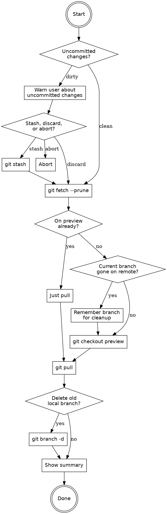

# Switch to Preview Branch

Switch to the `preview` development branch, pull the latest changes, and optionally clean up the current branch.

## Workflow



## Execution Steps

### Step 1: Check for uncommitted changes

Run `git status --porcelain`. If there is output (uncommitted changes exist):

- Show the user what's dirty (modified/untracked files)
- Ask what to do:
  - **Stash** — run `git stash push -m "auto-stash before switching to preview"`
  - **Continue anyway** — proceed without saving (changes carry over if no conflicts)
  - **Abort** — stop, let the user handle it

If clean, proceed directly.

### Step 2: Fetch and prune

```bash
git fetch --prune
```

This updates remote tracking info and removes references to deleted remote branches.

### Step 3: Check if current branch is gone on remote

If NOT already on `preview`, check whether the current branch still exists on the remote:

```bash
git branch -vv --list "$(git branch --show-current)"
```

If the output contains `[origin/...: gone]`, the branch has been deleted on the remote (merged and cleaned up). Remember the branch name for cleanup in Step 6.

### Step 4: Switch to preview

```bash
git checkout preview
```

### Step 5: Pull latest

```bash
git pull
```

### Step 6: Clean up old branch

If the previous branch was marked as `gone` (from Step 3):

- Tell the user: "Branch `{name}` was deleted on the remote (likely merged). Delete local copy?"
- If yes: `git branch -d {name}` (safe delete — fails if unmerged)
- If the user doesn't respond or says no, skip silently

If the branch was NOT gone, skip this step entirely — don't offer to delete active branches.

### Step 7: Summary

Show a brief one-line summary:
```
Switched to preview, pulled latest. {optional: Deleted local branch `feature/XYZ`.}
```

## Rules

- **Never delete branches that still exist on the remote.** Only offer cleanup for `gone` branches.
- **Use `git branch -d` (safe delete), never `-D`.** If the branch has unmerged commits, the delete will fail safely and that's fine — inform the user.
- **Don't ask unnecessary questions.** If the working tree is clean and the branch isn't gone, just switch and pull without prompting.
- **If already on preview**, just pull and skip everything else.
- **Keep output minimal.** No verbose logging unless something unexpected happens.
