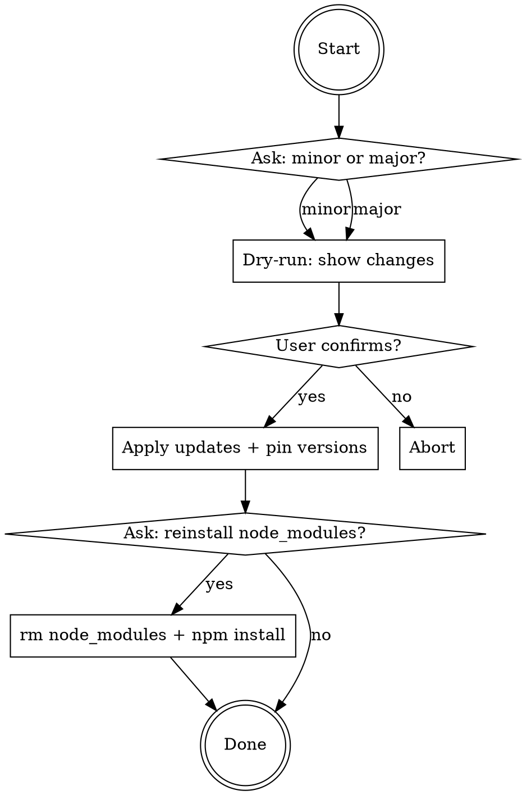

# Update npm Dependencies

Update project dependencies using `ncu` (npm-check-updates). Always preview first, then apply with pinned versions.

## Workflow



## Commands

**Preview (dry-run):**
```bash
# Minor/Patch only
ncu --target minor

# All including major
ncu
```

**Apply updates with pinned versions:**
```bash
# Minor/Patch only, pinned versions
ncu --target minor -u --removeRange

# All including major, pinned versions
ncu -u --removeRange
```

**Reinstall (when requested):**
```bash
rm -rf node_modules && npm install
```

## Rules

- **Always dry-run first.** Never run with `-u` before showing the user what will change.
- **Always pin versions.** Use `--removeRange` on every update run. No `^` or `~` prefixes.
- **Ask before reinstall.** Deleting `node_modules` is optional - always ask the user.
- If the user specifies a level (minor/major), use it directly without asking again.
- If the user does not specify a level, ask which mode they want.
