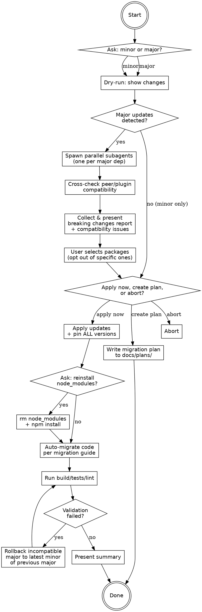

# Update npm Dependencies

Update project dependencies using `ncu` (npm-check-updates). Always preview first, then apply with pinned versions. For major updates, research breaking changes before applying.

## Workflow



## Phase 0: Prerequisites Check

Before running any commands, check if `ncu` is available:

```bash
which ncu
```

If `ncu` is not found, ask the user if they want to install it using AskUserQuestion with these options:

- **Install globally** — `npm install -g npm-check-updates`
- **Use npx** — skip installation, prefix all `ncu` commands with `npx` instead (e.g. `npx npm-check-updates --target minor`)
- **Abort** — cancel the update process

If the user chooses npx, replace all `ncu` calls in subsequent phases with `npx npm-check-updates`.

## Phase 1: Dry-Run

**Preview (dry-run):**
```bash
# Minor/Patch only
ncu --target minor

# All including major
ncu
```

Parse the output to identify which updates are major (first version number changed).

## Phase 2: Breaking Changes Research (Major Updates Only)

When major updates are detected, spawn **parallel Task subagents** (subagent_type: `general-purpose`) — one per dependency with a major version bump.

Each subagent receives this prompt:

```
Research the migration guide and breaking changes for upgrading {package} from {current_version} to {target_version}.

Search for:
1. Official migration guide or upgrade guide
2. Changelog entries for breaking changes
3. GitHub release notes

Return a structured summary:
- Package: {package} {current_version} → {target_version}
- Breaking changes: list of concrete breaking changes
- Migration steps: specific code changes needed (e.g. "rename X to Y", "remove config option Z", "replace API call A with B")
- References: URLs to official migration guide / changelog
- Confidence: "high" if official migration guide found, "low" if only changelog or release notes
```

**Launch all subagents in a single message** (parallel Task tool calls). Wait for all to complete, then collect results.

## Phase 2b: Cross-Dependency Compatibility Check

After researching breaking changes, **verify that each major update is compatible with the other packages in the project** before presenting results to the user. This catches ecosystem conflicts that individual package research misses.

For each major update candidate:

1. **Check peer dependency compatibility** — identify which other project dependencies depend on or are plugins for the package being updated. Use `npm ls {package} --depth=3` to see the dependency tree.
2. **Check if dependents support the new major version** — e.g., if upgrading `eslint` from v9 to v10, verify that `eslint-config-next`, `eslint-plugin-*`, `@typescript-eslint/*` and other ESLint ecosystem packages already support v10.
3. **Check plugin/config ecosystem readiness** — for packages with rich plugin ecosystems (ESLint, Babel, PostCSS, Webpack, etc.), verify that the plugins used in the project are compatible with the new major version. A package's own migration guide often lists known incompatible plugins.

**Common conflict patterns to watch for:**
- **ESLint major bumps**: `eslint-config-*`, `eslint-plugin-*` packages frequently lag behind ESLint major releases. Always verify the entire ESLint plugin chain is compatible.
- **TypeScript major bumps**: Check compatibility with `@typescript-eslint/*`, build tools, and framework type packages.
- **React major bumps**: Check compatibility with UI libraries, testing libraries (`@testing-library/react`), and framework integrations.
- **Build tool major bumps** (Webpack, Vite, Turbopack): Check compatibility with all loaders and plugins.

If a major update has **unresolvable compatibility conflicts** (e.g., a critical plugin doesn't support the new version yet):
- Flag it in the report as **"blocked — ecosystem not ready"**
- Recommend the latest minor/patch of the current major version instead
- Explain which dependency is blocking and link to its issue tracker if available

## Phase 3: Report & User Decision

Present a consolidated report to the user:

```
## Major Update Report

### {package} {current} → {target} (confidence: {high|low})
Breaking changes:
- {change 1}
- {change 2}
Migration steps:
- {step 1}
- {step 2}
References: {url}
```

Then ask the user with AskUserQuestion:

1. **Which packages to exclude** — let the user opt out of specific major updates
2. **What to do:**
   - **Apply now** — update packages and auto-migrate code in this session
   - **Create plan** — write a migration plan document for later execution, no code changes
   - **Abort** — cancel, no changes made

## Phase 4a: Apply Now

When the user chooses to apply immediately:

1. **Update package.json with ncu:**
   ```bash
   # All selected updates
   ncu -u --removeRange --filter {pkg1},{pkg2},...
   ```

2. **Pin ALL remaining loose versions** — after ncu runs, check `package.json` for any remaining `^` or `~` ranges (packages not touched by ncu). For these:
   - Run `npm ls {package} --depth=0` to get the actual installed version
   - Replace the range with the exact installed version in `package.json`
   - **Never guess versions** — always verify with `npm ls` first

3. **Reinstall** (ask user first):
   ```bash
   rm -rf node_modules && npm install
   ```

4. **Auto-migrate code** — for each package with migration steps:
   - Use Grep/Glob to find affected files (imports, API usages, config files)
   - Apply changes using Edit tool based on the migration steps from the research
   - After each package migration, run the project's build/test/lint command if available to verify no regressions

5. **Validate — run build, lint, and tests.** If any fail due to a major update incompatibility:
   - **Identify the root cause** — read the error carefully to determine which major update caused the failure
   - **Rollback that specific package** to the latest minor/patch of its previous major version (e.g., if `eslint@10.0.0` fails, find the latest `9.x` with `npm view eslint versions --json | grep '"9\.'` and pin to that)
   - **Re-run npm install** and validate again
   - **Report the rollback** in the summary with the reason (e.g., "eslint 10 rolled back to 9.39.2 because eslint-plugin-react does not yet support ESLint 10")

6. **Present summary:**
   - Which packages were updated (with before/after versions)
   - Which major updates were rolled back and why
   - Which files were modified for migration
   - Build/test/lint results (pass/fail)
   - Any migration steps that were skipped (low confidence or too ambiguous) — flag these for the user to handle manually

## Phase 4b: Create Plan

When the user chooses to create a plan, write to `docs/plans/YYYY-MM-DD-dependency-migration.md`:

```markdown
# Dependency Migration Plan

Generated: {date}

## Overview

| Package | Current | Target | Breaking Changes | Confidence |
|---------|---------|--------|-----------------|------------|
| {pkg}   | {curr}  | {tgt}  | {count}         | {high/low} |

## {package} {current} → {target}

### Breaking Changes
- {change 1}
- {change 2}

### Migration Steps
1. {step description}
   - Affected files: `{glob pattern or file paths}`
2. {step description}
   - Affected files: `{glob pattern or file paths}`

### References
- {url to migration guide}
```

After writing the plan:
- Tell the user the file path
- Explain they can execute the plan in any future session by referencing the file

## Rules

- **Always dry-run first.** Never run with `-u` before showing the user what will change.
- **Always pin ALL versions.** Use `--removeRange` on every update run. Additionally, after ncu runs, scan `package.json` for any remaining `^` or `~` ranges and pin those too using `npm ls` to get exact installed versions. No `^` or `~` prefixes should remain in the final `package.json`.
- **Never guess versions.** When pinning versions manually, always verify with `npm ls {package} --depth=0` first. Do not assume version numbers.
- **Ask before reinstall.** Deleting `node_modules` is optional — always ask the user.
- **Research before major updates.** Never apply a major update without researching breaking changes first.
- **Cross-check ecosystem compatibility before major updates.** After researching breaking changes, verify that all dependent packages (plugins, configs, type packages) in the project support the new major version. This is critical for packages with plugin ecosystems like ESLint, TypeScript, React, and build tools. If the ecosystem is not ready, recommend staying on the latest minor of the current major and flag it as "blocked".
- **Rollback on validation failure.** If build/lint/tests fail after a major update due to ecosystem incompatibility, do not leave the project broken. Automatically rollback to the latest minor/patch of the previous major version, re-validate, and clearly report the rollback with the reason.
- **Parallel subagents.** Always launch research agents in a single message with multiple Task tool calls for maximum speed.
- **Skip ambiguous migrations.** If a migration step has low confidence or is unclear, skip the auto-migration for that step and flag it for the user.
- **Run tests after migration.** If the project has a build or test command, run it after each package migration to catch issues early.
- **Run lint after migration.** If the project has a lint command, run it after each package migration to catch issues early.
- If the user specifies a level (minor/major), use it directly without asking again.
- If the user does not specify a level, ask which mode they want.
